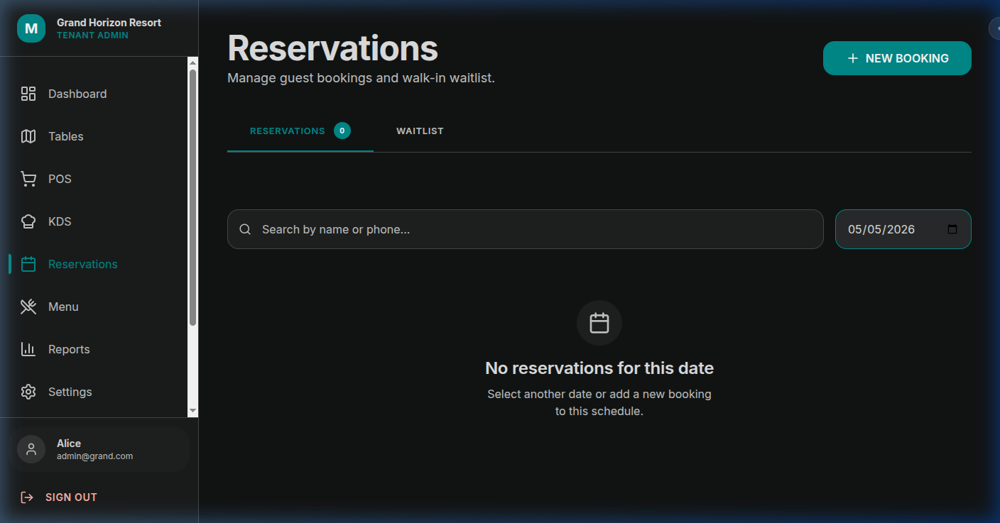
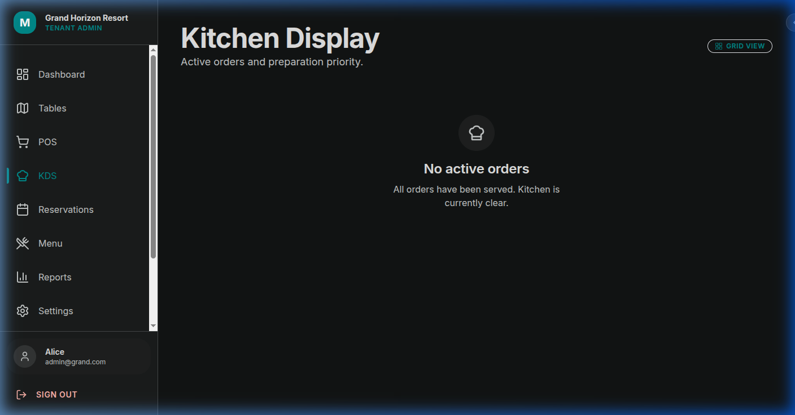
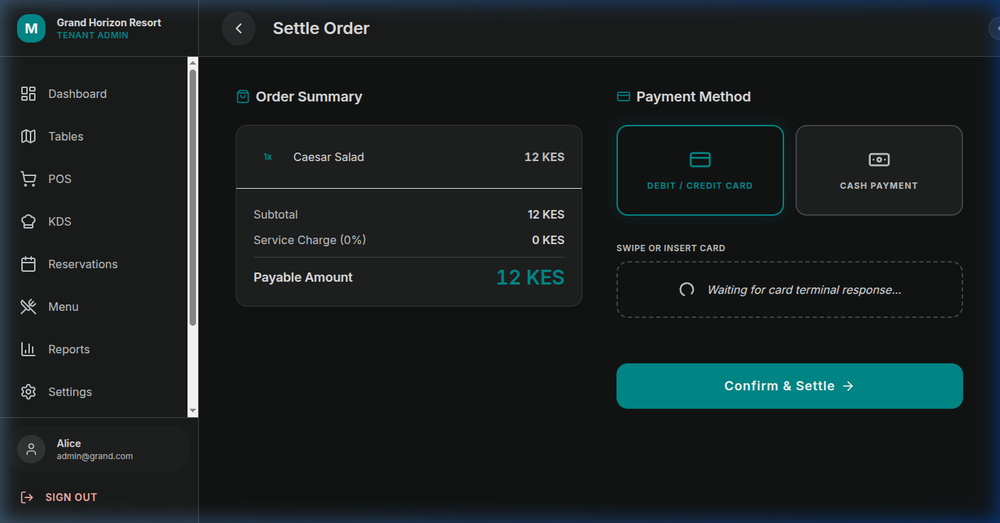

# Mumo Hospitality POS & Management Suite


A premium, multi-tenant hospitality management system designed for high-end resorts, restaurants, and hotels. Built with a focus on aesthetic excellence, performance, and strict data isolation.

## 🚀 Features

### 📊 Intelligent Dashboard
Real-time insights into revenue, active orders, occupancy, and staff activity. Features dynamic charts and critical inventory alerts.


### 🛒 Point of Sale (POS)
A fluid, touch-optimized ordering interface with category filtering, instant cart management, and seamless table/guest assignment.


### 🗺️ Table & Floor Management
Visual table grid with real-time occupancy status. Supports advanced operations like **Table Merging** and **Order Transfers**.


### 📅 Reservations & Waitlist
Integrated guest booking system. Manage upcoming reservations and prioritize walk-in guests with a digital waitlist.


### 🍳 Kitchen Display System (KDS)
Streamlined preparation workflow for kitchen staff with urgency-based highlighting and status transitions (Pending → Preparing → Ready).


### 💳 Seamless Checkout
Multiple payment method support (Cash/Card) with automatic table settlement and receipt generation.


## 🛠️ Tech Stack

- **Frontend**: React 18, TypeScript, Vite, Lucide Icons.
- **Styling**: Vanilla CSS with **Stitch Design System** (Tokens & Glassmorphism).
- **State Management**: Zustand (Global/Cart), React Query (Server State).
- **Backend**: Node.js, Express, Prisma ORM.
- **Database**: PostgreSQL.
- **Security**: JWT Authentication + RBAC (Role-Based Access Control).

## 📦 Project Structure

```bash
├── client/          # Vite-React frontend
│   ├── src/
│   │   ├── api/     # Service layer (Axios)
│   │   ├── components/
│   │   ├── pages/
│   │   └── store/   # Zustand State
├── server/          # Express backend
│   ├── src/
│   │   ├── routes/  # API Endpoints
│   │   ├── middleware/
│   │   └── lib/     # Prisma & Utilities
└── shared/          # TypeScript Types & Interfaces
```

## 🏗️ Getting Started

### Prerequisites
- Node.js (v18+)
- PostgreSQL

### Installation

1. **Clone the repository**
   ```bash
   git clone https://github.com/your-username/mumo-pos.git
   cd mumo-pos
   ```

2. **Setup Backend**
   ```bash
   cd server
   npm install
   # Create .env based on .env.example and set DATABASE_URL
   npx prisma migrate dev
   npm run dev
   ```

3. **Setup Frontend**
   ```bash
   cd ../client
   npm install
   # Create .env and set VITE_API_URL
   npm run dev
   ```

## 🛡️ Tenant Isolation
System uses a custom `x-tenant-id` header mechanism combined with JWT scoping to ensure that staff and guests only interact with data belonging to their specific property (e.g., Grand Horizon Resort vs. Seaside Bistro).

---

© 2026 Mumo Capital & Syntax. All rights reserved.
