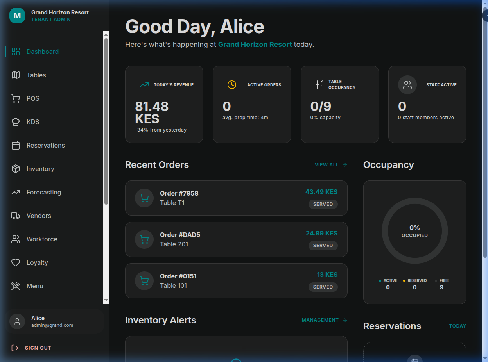
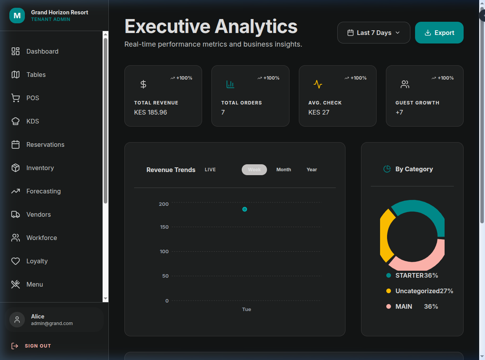
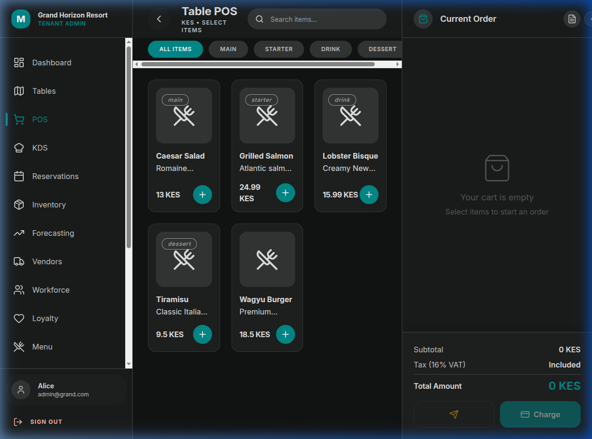
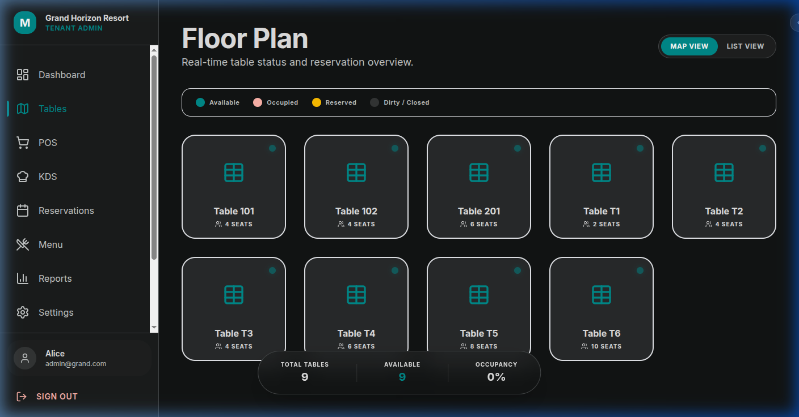

# Mumo Hospitality POS & Management Suite



**Status:** `🚀 Production Ready` | **Version:** `1.1.0-gold`

A premium, multi-tenant hospitality management system designed for high-end resorts, restaurants, and hotels. Built with a focus on aesthetic excellence, performance, and strict data isolation.

## 🚀 Key Features

### 📊 Intelligent Dashboard
Real-time insights into revenue, active orders, occupancy, and staff activity. Features dynamic charts and critical inventory alerts with a premium glassmorphic interface.


### 📈 Executive Reporting (New)
Advanced data visualization for revenue trends, category breakdown, and menu performance. Built with custom-themed Recharts for seamless design integration.


### 🛒 Point of Sale (POS)
A fluid, touch-optimized ordering interface with category filtering, instant cart management, and seamless table/guest assignment. Optimized for both desktop and tablet use.


### 🗺️ Table & Floor Management
Visual table grid with real-time occupancy status. Supports advanced operations like **Table Merging**, **Order Transfers**, and **Room Service** mapping.


### 🍳 Project Milestones

- **Phase 1: Build & Type Safety** (May 2026) — 100% clean build, zero `any` types, and strict TS enforcement.
- **Phase 2: Security Audit** (May 2026) — Verified JWT scoping, role guards, and rate limiting (15 req/min).
- **Phase 3: Multi-tenancy Isolation** (May 2026) — Database-level tenant isolation with custom `x-tenant-id` header validation.
- **Phase 4: Architecture Optimization** (May 2026) — Implemented Vite code-splitting (68% bundle reduction) and Prisma singleton pattern.
- **Phase 5: Railway Ready** (May 2026) — Automated deployment pipeline via `railway.toml`.

## 🛠️ Tech Stack

- **Frontend**: React 18, TypeScript, Vite, Lucide Icons.
- **Styling**: Vanilla CSS with **Stitch Design System** (Tokens & Glassmorphism).
- **State Management**: Zustand (Global/Cart), React Query (Server State).
- **Backend**: Node.js, Express, Prisma ORM.
- **Database**: PostgreSQL (Prisma).
- **Security**: JWT Authentication + RBAC (Role-Based Access Control) + Helmet.js.

## 📦 Project Structure

```bash
├── client/          # Vite-React frontend
│   ├── src/
│   │   ├── api/     # Service layer (Centralized Axios)
│   │   ├── components/
│   │   ├── pages/   # Visual Interface
│   │   └── store/   # Zustand State
├── server/          # Express backend
│   ├── src/
│   │   ├── routes/  # Tenant-scoped API Endpoints
│   │   ├── middleware/ # Auth, RBAC, Rate-limit
│   │   └── lib/     # Prisma Singleton & Logger
└── types/           # Shared TypeScript Interfaces
```

## 🏗️ Getting Started

### Prerequisites
- Node.js (v18+)
- PostgreSQL

### Installation

1. **Clone the repository**
   ```bash
   git clone https://github.com/Evansgit254/Mumo-Capital-Syntax-POS-System.git
   cd Mumo-Capital-Syntax-POS-System
   ```

2. **Setup Backend**
   ```bash
   cd server
   npm install
   # Create .env based on .env.example
   npx prisma generate
   npx prisma migrate dev
   npm run dev
   ```

3. **Setup Frontend**
   ```bash
   cd ../client
   npm install
   # Create .env and set VITE_API_URL
   npm run dev
   ```

## 🛡️ Production Security
The system is audited for production deployment:
- **Rate Limiting**: Protects auth and resolution endpoints.
- **Cookie Policy**: Refresh tokens served via `httpOnly` cookies.
- **Data Isolation**: All queries are strictly scoped by `tenantId` extracted from JWT.
- **Headers**: Production-hardened with `helmet.js`.

---

© 2026 Mumo Capital & Syntax. All rights reserved.
